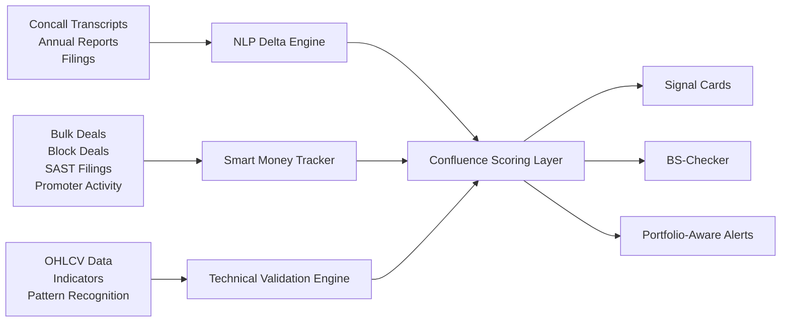

# ET Sentinel

**ET Sentinel is an AI Confluence Engine for retail investors.**  
It looks for the moment when a **fundamental trigger**, a **smart-money/liquidity event**, and a **technical setup** all align at once, then turns that alignment into a clear, actionable signal.

Most investors lose money in one of two ways:

- They buy a good company at the wrong time.
- They buy a technically strong chart with weak underlying business signals.

ET Sentinel is built to solve exactly that problem.

## The Idea

ET Sentinel does not aim to be another noisy market dashboard.

It is designed to behave like a focused institutional screening layer for Indian equities, especially across **NSE/BSE names**, where the product continuously asks:

> "Is something important changing in the business, is smart money moving, and is the chart confirming it right now?"

If the answer is yes, the app surfaces a **high-conviction setup**.

If the answer is no, it protects the user from hype, recency bias, and random tips.

## Why This Exists

Retail investors are flooded with:

- Telegram tips
- finance influencers
- delayed news
- generic screeners
- isolated technical indicators
- isolated fundamental summaries

What they usually do **not** get is **confluence**.

That gap is where ET Sentinel lives.

## Product Vision

ET Sentinel combines three background engines into one simple user experience.

### 1. NLP Delta Engine

This engine tracks the **change in management language**, not just the latest statement in isolation.

Instead of summarizing a 50-page annual report or earnings transcript, it compares recent quarters and asks:

- Is management becoming more confident?
- Are they signaling margin expansion?
- Are they talking about capex, deleveraging, or demand recovery?
- Are they quietly shifting tone before the market reprices the stock?

**Output:** a weighted **Sentiment Delta** that flags changes in forward-looking commentary while filtering out PR fluff.

### 2. Smart Money Tracker

This engine watches for non-random movement in ownership and liquidity.

It is intended to ingest:

- bulk deals
- block deals
- SEBI SAST filings
- promoter activity
- promoter pledge revocations

The goal is not to flag every trade. The goal is to identify **anomalies that matter**, such as:

- discretionary buying by strong DIIs
- insider conviction
- meaningful accumulation during long consolidations

**Output:** a liquidity trigger that separates signal from routine rebalancing noise.

### 3. Technical Validation Engine

This engine answers the timing question.

Even a strong business trigger is not useful if price is stuck below major resistance or breaking down structurally.

It is intended to continuously scan for setups like:

- breakout from consolidation
- support bounce near key moving averages
- RSI divergence
- cup-and-handle or base formation

It also adds localized context:

- "What happened the last time this stock showed this exact setup?"
- "What is the probability of a 5%+ move in the next 14 days?"

**Output:** a timing layer that converts raw signal into decision-ready context.

## What The User Sees

The frontend is designed to hide the complexity and present a curated experience instead of an overwhelming dashboard.

### Confluence Feed

The main feed surfaces high-conviction signal cards with:

- the trigger
- the timing
- historical odds
- risk management context

### BS-Checker

The "gut-feel validator" lets a user type a stock name or ticker, such as `SUZLON`, and get an instant read on whether:

- fundamentals support the idea
- liquidity supports the idea
- technicals support the idea

This is the anti-hype layer of the product.

### Opportunity Radar

This view is meant to be portfolio-aware.

If a user syncs holdings or uploads exposure, ET Sentinel can flag things like:

- a mutual fund reducing a name the user still owns directly
- a stock in the portfolio losing confluence
- a fresh opportunity emerging inside current holdings

## Signal Format

Every strong event is compressed into a simple card:

- **Headline:** High Conviction Setup: Tata Motors
- **Trigger:** Promoter bought shares and management upgraded guidance
- **Timing:** Breakout from consolidation on strong volume
- **Historical Odds:** Localized win-rate context from past occurrences
- **Risk Management:** Suggested stop-loss zone based on structure

That is the core promise of the product:

**complex backend intelligence, simple front-end clarity**

## Current Repo Status

This repository currently contains a **frontend prototype** of ET Sentinel.

What is in the repo today:

- a React + TypeScript + Vite app
- a dark-mode prototype UI for the feed, BS-Checker, and portfolio radar
- mocked data for signals, health checks, and holdings
- environment wiring for future Gemini-based AI features

What is not yet implemented:

- live transcript ingestion
- real NSE/BSE or SEBI market data pipelines
- brokerage or demat sync
- backend scoring services
- backtesting infrastructure
- production alerting

The current app is best understood as the **product shell and interaction model** for the larger ET Sentinel system.

## Architecture Direction



## Tech Stack

- React 19
- TypeScript
- Vite
- Tailwind CSS v4
- `motion` for UI animation
- `lucide-react` for icons
- Gemini API environment plumbing for future AI workflows

## Getting Started

### 1. Install dependencies

```bash
npm install
```

### 2. Configure environment variables

Create a `.env` file from `.env.example`.

```bash
cp .env.example .env
```

If you are on Windows PowerShell:

```powershell
Copy-Item .env.example .env
```

### 3. Start the development server

```bash
npm run dev
```

### 4. Build for production

```bash
npm run build
```

### 5. Type-check the codebase

```bash
npm run lint
```

## Environment Variables

| Variable | Purpose |
| --- | --- |
| `GEMINI_API_KEY` | Reserved for future Gemini-powered AI analysis workflows |
| `APP_URL` | Intended app base URL for hosted/runtime integrations |

## Product Principles

- **Confluence over noise**: no isolated signals without supporting context
- **Explainability over black-box scores**: every alert should be understandable in plain English
- **Timing matters**: fundamentals without chart confirmation are incomplete
- **Risk first**: every bullish idea should include downside framing
- **Retail-friendly UX**: powerful backend, simple interface

## Roadmap

- ingest and compare quarterly management commentary
- score sentiment shifts around real business drivers
- integrate smart-money signals from filings and deal feeds
- run technical scans across a broader stock universe
- attach per-stock historical outcome probabilities
- enable broker sync and portfolio-aware alerting
- move from mocked demo data to live production pipelines

## Who This Is For

- serious retail investors
- swing traders who care about business quality
- fundamental investors who want better entry timing
- anyone tired of buying stories without confirmation

## Disclaimer

ET Sentinel is a research and decision-support product concept. It is **not** investment advice, portfolio management, or a guarantee of performance. Any live version should include proper compliance, data licensing, and risk disclosures before public launch.

---

If you are building this out, the long-term opportunity is compelling:

**be the product that tells investors not just what is happening, but when it matters.**
